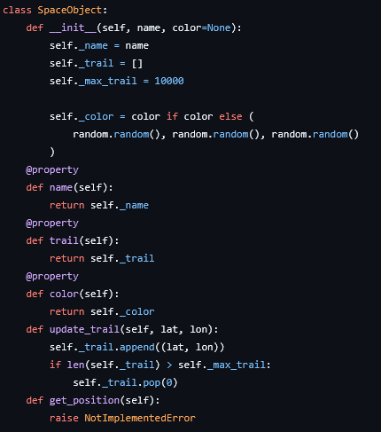
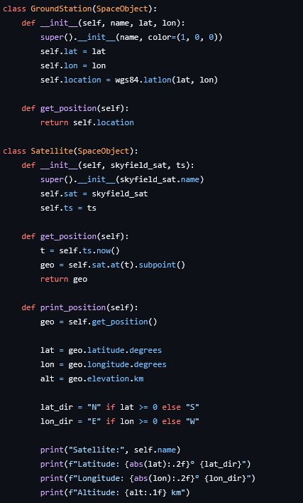
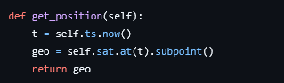
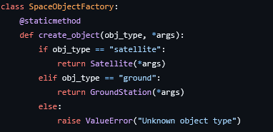
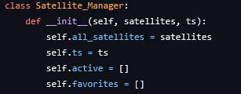
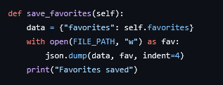
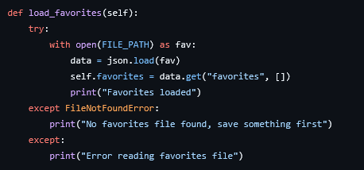
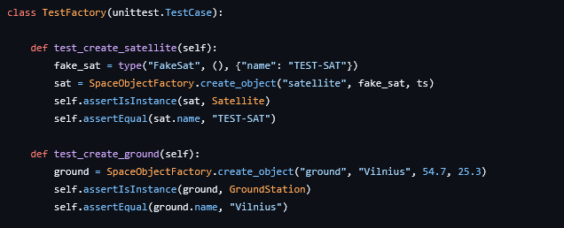
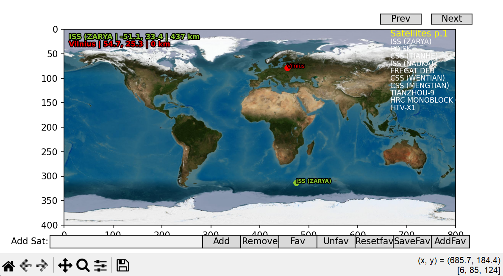

# Satellite Tracking System - OOP kursinis darbas
# Laurynas Davidavičius EIRf-25

## 1. Įvadas
Šio darbo tikslas – sukurti palydovų sekimo sistemą, kuri realiu laiku atvaizduoja palydovų pozicijas pasaulio žemėlapyje.
Sistema leidžia vartotojui pridėti ir pašalinti palydovus, valdyti mėgstamus (favorites) bei stebėti jų matomumą iš antžeminių stočių.
Programa paleidžiama vykdant pagrindinį failą SatelliteTrackingSystem.py.
Naudotojas gali įvesti palydovo pavadinimą, jį pridėti prie žemėlapio, pašalinti, išsaugoti į favorites ar atkurti favorites sąrašą.

## Reikalavimai
Reikalingos bibliotekos:
- Library: skyfield  
  Install command:
  ```bash
  pip install skyfield
- Library: matplotlib  
  Install command:
  ```bash
  pip install matplotlib

## 2. Analizė

### 2.1 Objektinio programavimo principai
Šioje sistemoje įgyvendinti visi keturi pagrindiniai objektinio programavimo principai: enkapsuliacija, paveldėjimas, polimorfizmas ir abstrakcija.

#### Enkapsuliacija
Enkapsuliacija reiškia duomenų slėpimą ir jų valdymą per metodus. Programoje objektų atributai yra saugomi kaip privatūs (pvz., `_name`, `_trail`), o prieiga prie jų suteikiama per metodus arba properties.
Tai leidžia apsaugoti duomenis nuo tiesioginio keitimo ir lengviau valdyti.

*1 pav. SpaceObject klasė*

#### Paveldėjimas
Paveldėjimas leidžia kurti naujas klases, kurios perima savybes iš bazinės klasės. Šioje programoje klasės `Satellite` ir `GroundStation` paveldi bendrą klasę `SpaceObject`.
Tai leidžia išvengti kodo dubliavimo ir naudoti tas pačias funkcijas skirtingiems objektams.

*2 pav. Paveldėjimas tarp Satellite, GroundStation ir SpaceObject*

#### Polimorfizmas
Polimorfizmas leidžia naudoti tą patį metodą skirtingiems objektams, tačiau su skirtingu elgesiu. Programoje metodas `get_position()` yra realizuotas skirtingai klasėse `Satellite` ir `GroundStation`.
Nepaisant to, jis gali būti kviečiamas vienodai visoje sistemoje, nepriklausomai nuo objekto tipo.

*3 pav. get_position metodo realizacija Satellite klasėje*

#### Abstrakcija
Abstrakcija leidžia aprašyti bendrą idėją, neįsigilinant į visas detales. Klasė `SpaceObject` nurodo, kad turi būti metodas `get_position()`, tačiau jo pati neaprašo. 
Šį metodą įgyvendina kitos klasės, tokios kaip `Satellite` ir `GroundStation`.

### 2.2 Dizaino šablonas – Factory
Šioje programoje naudojamas Factory dizaino šablonas, kuris leidžia kurti skirtingų tipų objektus naudojant vieną bendrą metodą.
Factory šablonas yra naudingas tais atvejais, kai reikia kurti objektus, tačiau nenorima tiesiogiai naudoti jų konstruktorių skirtingose programos vietose. Vietoje to, objektų kūrimas yra centralizuojamas vienoje vietoje.
Programoje šis šablonas realizuotas naudojant `SpaceObjectFactory` klasę.

#### Naudojimas programoje
Factory yra naudojamas, kai reikia dinamiškai sukurti objektus, pavyzdžiui:
- Pridedant palydovą pagal pavadinimą  
- Sukuriant antžeminę stotį (pvz., Vilnius)  
Tai leidžia išlaikyti kodą tvarkingą ir lengvai plečiamą.

*4 pav. SpaceObjectFactory klasė ir objektų kūrimas*

#### Kodėl pasirinktas Factory šablonas
Factory šablonas buvo pasirinktas, nes programoje reikia kurti skirtingų tipų objektus (palydovus ir antžemines stotis), tačiau jų kūrimo logika yra panaši.
Palyginus su kitais šablonais, pvz., Singleton, Factory yra tinkamesnis, nes čia svarbu ne vieno objekto egzistavimas, o lankstus skirtingų objektų kūrimas.

### 2.3 Agregacija
Šioje programoje naudojamas agregacijos principas, kuris reiškia, kad vienas objektas turi nuorodas į kitus objektus, tačiau tie objektai gali egzistuoti nepriklausomai.
Programoje agregacija realizuota naudojant `Satellite_Manager` klasę, kuri saugo palydovų ir antžeminių stočių sąrašus.

#### Agregacijos realizacija
`Satellite_Manager` klasė turi sąrašą `active`, kuriame laikomi aktyvūs objektai (palydovai ir antžeminės stotys). Šie objektai yra sukuriami atskirai naudojant Factory ir vėliau perduodami manageriui.
Tai reiškia, kad:
- `Satellite_Manager` valdo objektus  
- tačiau objektai nepriklauso nuo managerio

*5 pav. Satellite_Manager klasė ir aktyvių objektų sąrašas*

#### Kodėl tai yra agregacija
Jeigu `Satellite_Manager` būtų pašalintas, palydovai ir antžeminės stotys vis tiek galėtų egzistuoti atskirai. Jie nėra kuriami kaip managerio dalis, o tik saugomi jame.
Tai atitinka agregacijos principą, kai objektai yra susiję, bet nėra stipriai priklausomi vienas nuo kito. 

### 2.4 Failų skaitymas ir rašymas
Programoje įgyvendintas duomenų saugojimas ir nuskaitymas iš failo, naudojant JSON formatą. Tai leidžia išsaugoti vartotojo pasirinktus mėgstamus palydovus (favorites) ir juos atkurti vėliau.

#### Duomenų saugojimas
Funkcija `save_favorites()` išsaugo dabartinį favorites sąrašą į failą `favorites.json`. Duomenys yra saugomi JSON formatu, kuris yra lengvai skaitomas ir struktūrizuotas.
Tai leidžia programai išlaikyti vartotojo pasirinkimus net ir po programos uždarymo.

*6 pav. Favorites išsaugojimas į failą*

#### Duomenų nuskaitymas
Funkcija `load_favorites()` nuskaito duomenis iš failo `favorites.json` ir atkuria favorites sąrašą programoje.
Jeigu failas neegzistuoja, programa tai apdoroja ir pateikia atitinkamą pranešimą, taip užtikrinant stabilų veikimą.

*7 pav. Favorites nuskaitymas iš failo*

### 2.5 Testavimas
Programos pagrindinis funkcionalumas buvo testuojamas naudojant `unittest` framework. Testai leidžia patikrinti, ar svarbiausios sistemos dalys veikia teisingai ir padeda greičiau aptikti klaidas.

#### Testavimo tikslas
Testavimo metu buvo siekiama patikrinti:
- ar teisingai kuriami objektai (Factory veikimas)  
- ar veikia palydovų pridėjimas ir pašalinimas  
- ar teisingai atnaujinami objektų duomenys (pvz., trail)  

#### Testų realizacija
Buvo sukurtas atskiras testavimo failas, kuriame naudojamos `unittest` klasės ir metodai. Testuose naudojami dirbtiniai (fake) objektai, siekiant izoliuoti testuojamą funkcionalumą.
img-unittest-setup

#### Pavyzdiniai testai
Testuojamos šios funkcijos:
- `SpaceObjectFactory.create_object()` – tikrinama ar sukuriami teisingi objektai  
- `Satellite_Manager.add_satellite()` – tikrinamas palydovo pridėjimas  
- `Satellite_Manager.remove_satellite()` – tikrinamas pašalinimas  
- `update_trail()` – tikrinamas duomenų atnaujinimas  

*8 pav. unittest testavimo pavyzdys*

### 2.6 Vartotojo UI
Programos vartotojo UI realizuota naudojant `matplotlib` biblioteką, kuri leidžia ne tik vizualizuoti duomenis, bet ir kurti interaktyvius valdiklius.
Sistema pateikia dvimatį pasaulio žemėlapį, kuriame realiu laiku atvaizduojami palydovai, jų trajektorijos bei antžeminės stotys.

*9 pav. Palydovų sekimo sistemos vartotojo sąsaja*

#### Interaktyvūs valdikliai
Vartotojo sąsajoje naudojami šie elementai:
- `TextBox` – leidžia įvesti palydovo pavadinimą  
- `Button` – leidžia atlikti veiksmus (Add, Remove, Fav, Unfav, Save, AddFav, Reset)  
Šie valdikliai suteikia galimybę vartotojui lengvai valdyti programą be komandų eilutės.

#### Palydovų atvaizdavimas
Palydovai yra atvaizduojami žemėlapyje pagal jų geografinę poziciją. Taip pat rodoma jų judėjimo trajektorija (trail), kuri atnaujinama realiu laiku.
Papildomai, jei palydovas yra matomas iš antžeminės stoties, tarp jų nubrėžiama linija.

#### Palydovų sąrašas
Dešinėje žemėlapio pusėje pateikiamas palydovų sąrašas, kuris yra suskirstytas į puslapius (po 10 elementų).
Vartotojas gali naršyti sąrašą naudodamas „Prev“ ir „Next“ mygtukus.

#### Papildomos funkcijos
Sistema taip pat turi papildomas funkcijas:
- mėgstamų palydovų (favorites) saugojimą  
- favorites atkūrimą iš failo  
- aktyvių palydovų valdymą  
Tai leidžia vartotojui greitai pasiekti dažniausiai naudojamus palydovus.

## 3. Rezultatai
- Sėkmingai sukurta palydovų sekimo sistema, kuri realiu laiku atvaizduoja palydovus pasaulio žemėlapyje.  
- Įgyvendinti visi pagrindiniai objektinio programavimo principai: enkapsuliacija, paveldėjimas, polimorfizmas ir abstrakcija.  
- Programoje pritaikytas Factory dizaino šablonas bei agregacijos principas.  
- Sukurta interaktyvi vartotojo sąsaja su mygtukais, leidžianti valdyti palydovus ir jų sąrašą.  
- Daugiausia problemų buvo susiję su vartotojo sąsajos realizacija ir duomenų perdavimu tarp skirtingų sistemos komponentų.  

## 4. Išvados
Šio darbo metu buvo sukurta pilnai veikianti palydovų sekimo sistema, kuri leidžia realiu laiku stebėti palydovų judėjimą ir juos valdyti per interaktyvią vartotojo sąsają.
Programoje sėkmingai pritaikyti objektinio programavimo principai bei dizaino šablonai, kurie padėjo sukurti aiškią ir lengvai plečiamą sistemos struktūrą.
Sukurta sistema yra funkcionali ir gali būti toliau tobulinama, pavyzdžiui, pridedant daugiau duomenų šaltinių.
